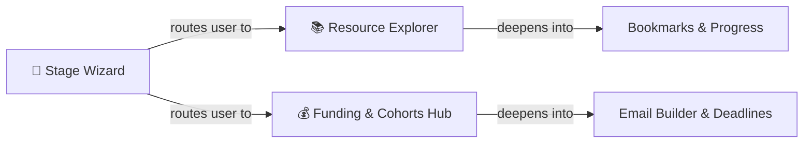
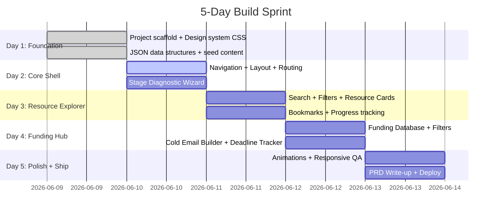

# Implementation Plan: Reimagining the eDC Knowledge Base

> **The only question that matters:** *Would someone actually want to use this?*

---

## 1. Problem Diagnosis

The existing Notion portal at `edciitd.notion.site` fails not because of bad intent, but because it was designed as a **filing cabinet** in a world that expects a **guide**.

| Symptom | Root Cause |
|:---|:---|
| Content frozen at 2022–23, placeholder pages | No maintainability story — updating is manual and tedious |
| Students don't open it voluntarily | Zero personalization — a first-year explorer and a pitch-ready founder see the same wall of links |
| Poor discovery — must know what you're looking for | Flat hierarchy with no guided pathways or search |
| Generic Notion gallery, no identity | No design investment — it doesn't feel like it belongs to eDC |
| No reason to return | Entirely static — nothing signals "something new is here" |

### The Reframe

The Knowledge Base shouldn't be a library. It should be a **launchpad** — an opinionated, stage-aware tool that meets each student where they are and shows them *exactly* what to do next.

> **From:** *"Here are 200 links, good luck."*
> **To:** *"You're at Stage X. Here's your next step."*

---

## 2. Target Users

Three archetypes on the IIT Delhi campus, each with fundamentally different needs:

| Persona | Who They Are | What They Need | What Makes Them Return |
|:---|:---|:---|:---|
| **The Explorer** | Curious student, no idea or team yet. Intimidated by startup jargon. | Curated, beginner-friendly learning paths. "Start here" clarity. | Progress tracking — "I've completed 4/10 modules" |
| **The Builder** | Has an idea or early prototype. Needs to validate, build, and navigate IITD systems. | Makerspace access guides, i-TTO walkthroughs, co-founder resources, competition calendars. | Checklists that track their startup journey milestones |
| **The Fundseeker** | Pitch-ready team looking for capital, cohorts, and investor connections. | Filterable funding database, pitch templates, cold email frameworks, cohort deadlines. | Live cohort deadline countdowns and new funding opportunities |

### Why Three Personas Matter for This Submission
The brief says *"Did you understand the real problem?"* — the real problem is that a single static page tries to serve all three audiences equally and ends up serving none of them well. Acknowledging this distinction in the UI is the core product insight.

---

## 3. Core Features (Focused on 3 That Matter)

The brief explicitly warns against over-engineering. Instead of 6+ features executed shallowly, we go deep on **three features that directly solve the core problems**:



### Feature 1: Stage Diagnostic Wizard (The Gateway)
**Problem it solves:** Choice paralysis. Students land on the site and don't know where to start.

- A 3-question micro-quiz on first visit: *"What best describes you?"*
  - "I'm curious about startups" → Explorer track
  - "I have an idea and want to build" → Builder track  
  - "I need funding or investors" → Fundseeker track
- Result: A **personalized dashboard** that surfaces only the resources, tools, and deadlines relevant to their stage.
- Stored in `localStorage` so returning users skip straight to their dashboard.

**Why this wins:** It's the single biggest UX upgrade over the Notion page. It transforms a passive directory into an active guide.

### Feature 2: Resource Explorer (Smart Library)
**Problem it solves:** Discovery is broken — flat lists with no filtering, no search, no context.

- Unified, searchable database of all LEARN content: books, podcasts, courses, reports.
- **Filters**: Content type (book/podcast/report/course), difficulty level, time commitment, topic tags.
- **Fuzzy search**: Type "lean startup" or "blume ventures report" and get instant results.
- **Bookmark & track**: Mark resources as "saved" or "completed" — progress persists in localStorage.
- Each resource card shows: title, type icon, estimated time, difficulty badge, and a direct external link.

**Why this wins:** It replaces the weakest part of the current portal (static gallery of cards with no metadata) with something genuinely useful.

### Feature 3: Funding & Cohorts Hub (Actionable Database)
**Problem it solves:** The RAISE section is a flat list of funding options with no context, no deadlines, and no actionable tools.

- **Filterable funding database**: Filter by type (grant/VC/incubator/cohort), stage (pre-seed/seed), sector, and application status (open/closed/upcoming).
- **Cohort deadline tracker**: Visual countdown timers for upcoming application deadlines (YC, Antler, Build3, BIRAC, etc.).
- **Cold email template builder**: A simple form widget — input your startup name, one-liner, traction metrics, and ask → outputs a polished, copyable cold email based on proven VC frameworks.
- **Pitch resource cards**: Direct links to pitch deck templates, investor research guides, and eDC mentorship booking.

**Why this wins:** It turns static information into a *tool*. A student can walk away with a drafted cold email and a list of upcoming deadlines — that's immediate, tangible value.

---

## 4. The Return Loop — Why Students Come Back

This is the critical gap in the current portal. A resource site without a return loop is a one-visit site.

| Mechanism | How It Works |
|:---|:---|
| **Progress Persistence** | localStorage tracks completed resources, saved bookmarks, and checklist items. Returning users see "Welcome back — you've explored 12/45 resources." |
| **Deadline Urgency** | Cohort deadlines with countdown timers create natural "check back" moments. If YC's deadline is in 8 days, students have a reason to revisit. |
| **Stage Progression** | As users complete resources in the Explorer track, the wizard nudges them: "Ready to move to Builder?" — creating a sense of journey. |
| **Fresh Content Signals** | A "Recently Added" badge system on new resources. Even with JSON-based content, a `dateAdded` field enables this cheaply. |

---

## 5. Information Architecture

Replacing the flat LEARN / STARTUP / RAISE with a **stage-driven, goal-oriented structure**:

```
eDC Launchpad
├── Home (Stage Wizard + Personalized Dashboard)
├── Explore (Resource Explorer)
│   ├── All Resources (searchable, filterable)
│   ├── Curated Tracks
│   │   ├── "Startup Fundamentals" (5 resources)
│   │   ├── "Market Validation 101" (4 resources)
│   │   └── "Fundraising Playbook" (6 resources)
│   └── My Bookmarks & Progress
├── Launch (IITD Startup Tools)
│   ├── Campus Connects (Makerspace, i-TTO, R&D)
│   ├── Competitions & Programs
│   └── Founder Checklist (interactive)
├── Fund (Funding & Cohorts Hub)
│   ├── Funding Database (filterable)
│   ├── Upcoming Deadlines
│   ├── Cold Email Builder
│   └── Pitch Resources
└── About eDC + Newsletter + Mentorship Link
```

---

## 6. UI Wireframes

### Leaderboard Placement Rules

| Page | Leaderboard? | Reason |
|:-----|:-------------|:-------|
| 🏠 Dashboard | ❌ No | Clean, full-width welcoming experience |
| 📚 Explore | ✅ Yes — right sidebar | Core gamification page |
| 🛠️ Launch | ✅ Yes — right sidebar | Track milestones |
| 💰 Fund | ✅ Yes — right sidebar | Motivation while exploring funding |
| 📰 News | ❌ No | Read-only feed, no XP interaction |

### 6.1 Dashboard (`/`) — Full-Width, No Leaderboard

```
┌────────────────────────────────────────────────────────────────┐
│  SIDEBAR (fixed)  │          MAIN CONTENT (full width)        │
│                   │                                           │
│  eDC Logo         │  ┌───────────────────────────────────────┐│
│                   │  │  👋 Welcome, {Name}                   ││
│  🏠 Dashboard ◄── │  │  "Your startup journey starts here"  ││
│  📚 Explore       │  └───────────────────────────────────────┘│
│  🛠️ Launch        │                                           │
│  💰 Fund          │  ┌───────────────────────────────────────┐│
│  📰 News          │  │  🧭 STAGE DIAGNOSTIC WIZARD           ││
│                   │  │                                       ││
│  ────────         │  │  [ Explorer ] [ Builder ]             ││
│  🔐 Login         │  │  [ Launcher ] [ Scaler  ]             ││
│                   │  └───────────────────────────────────────┘│
│                   │                                           │
│                   │  ┌───────────────────────────────────────┐│
│                   │  │  📚 RECOMMENDED FOR YOU               ││
│                   │  │  ┌────────┐ ┌────────┐ ┌────────┐    ││
│                   │  │  │ Book 1 │ │ Pod 1  │ │ Vid 1  │    ││
│                   │  │  │ +5 XP  │ │ +3 XP  │ │ +5 XP  │    ││
│                   │  │  └────────┘ └────────┘ └────────┘    ││
│                   │  └───────────────────────────────────────┘│
│                   │                                           │
│                   │  ┌──────────────────┐ ┌──────────────────┐│
│                   │  │ 🛠️ LAUNCH         │ │ ⏰ DEADLINES     ││
│                   │  │ PROGRESS          │ │                  ││
│                   │  │ ████████░░ 4/8    │ │ YC S26 ⚡5 days  ││
│                   │  │ ──► /launch       │ │ ──► /fund       ││
│                   │  └──────────────────┘ └──────────────────┘│
│                   │                                           │
│                   │  ┌───────────────────────────────────────┐│
│                   │  │  📰 LATEST STARTUP NEWS               ││
│                   │  │  • "AI Startup raises $50M..."        ││
│                   │  │  • "New DPIIT policy for..."          ││
│                   │  └───────────────────────────────────────┘│
└────────────────────────────────────────────────────────────────┘
```

#### Dashboard Sections

| # | Section | What It Does | Links To |
|:--|:--------|:-------------|:---------|
| 1 | **Hero Banner** | Greeting + tagline, glassmorphic card | — |
| 2 | **Stage Wizard** | 4 clickable stage buttons, saves choice to localStorage | Filters all `/explore` content |
| 3 | **Recommended Resources** | 3 horizontally scrollable cards based on selected stage | `/explore?highlight={id}` |
| 4 | **Launch Progress** | Progress bar showing checklist completion | `/launch` |
| 5 | **Deadline Alerts** | Upcoming funding/cohort deadlines with countdown | `/fund` |
| 6 | **News Preview** | 3 latest headlines from the daily feed | `/news` |

---

### 6.2 Explore (`/explore`) — With Leaderboard Sidebar

```
┌──────────────────────────────────────────────────────────────────────────┐
│ SIDEBAR (fixed)  │         MAIN CONTENT                     │ 🏆 LB    │
│                  │                                          │          │
│ eDC Logo         │ ┌──────────────────────────────────────┐ │ Leader-  │
│                  │ │  🔍 Search Resources...        [🔎]  │ │ board    │
│ 🏠 Dashboard     │ └──────────────────────────────────────┘ │          │
│ 📚 Explore ◄──   │                                          │ ┌──────┐ │
│ 🛠️ Launch        │ ┌──────────────────────────────────────┐ │ │ #1   │ │
│ 💰 Fund          │ │  FILTER BAR                          │ │ │ Ravi │ │
│ 📰 News          │ │                                      │ │ │320XP│ │
│                  │ │  Stage:  [All] [Explorer] [Builder]  │ │ ├──────┤ │
│ ────────         │ │         [Launcher] [Scaler]          │ │ │ #2   │ │
│ 🔐 Login         │ │                                      │ │ │ Amit │ │
│                  │ │  Type:   [📖 Books] [🎙️ Podcasts]    │ │ │280XP│ │
│                  │ │          [🎥 Videos] [📝 Courses]     │ │ ├──────┤ │
│                  │ │                                      │ │ │ #3   │ │
│                  │ │  Sort:   [Trending] [Newest] [A-Z]   │ │ │ You  │ │
│                  │ └──────────────────────────────────────┘ │ │150XP│ │
│                  │                                          │ ├──────┤ │
│                  │ ┌──────────────────────────────────────┐ │ │ #4   │ │
│                  │ │  📖 BOOKS  (12 results)              │ │ │ ...  │ │
│                  │ │                                      │ │ └──────┘ │
│                  │ │  ┌────────────┐ ┌────────────┐      │ │          │
│                  │ │  │ 📕         │ │ 📗         │      │ │ Your XP  │
│                  │ │  │ The Lean   │ │ Zero to    │      │ │ ████░░   │
│                  │ │  │ Startup    │ │ One        │      │ │ 150 XP   │
│                  │ │  │ ⭐⭐⭐⭐     │ │ ⭐⭐⭐⭐⭐   │      │ │          │
│                  │ │  │ +5 XP      │ │ +5 XP      │      │ │          │
│                  │ │  │ [✅ Done]  │ │ [☐ Mark]   │      │ │          │
│                  │ │  └────────────┘ └────────────┘      │ │          │
│                  │ │                                      │ │          │
│                  │ │  ┌────────────┐ ┌────────────┐      │ │          │
│                  │ │  │ 📘         │ │ 📙         │      │ │          │
│                  │ │  │ Hooked     │ │ Startup    │      │ │          │
│                  │ │  │            │ │ Playbook   │      │ │          │
│                  │ │  │ ⭐⭐⭐⭐     │ │ ⭐⭐⭐       │      │ │          │
│                  │ │  │ +5 XP      │ │ +5 XP      │      │ │          │
│                  │ │  │ [☐ Mark]   │ │ [☐ Mark]   │      │ │          │
│                  │ │  └────────────┘ └────────────┘      │ │          │
│                  │ └──────────────────────────────────────┘ │          │
│                  │                                          │          │
│                  │ ┌──────────────────────────────────────┐ │          │
│                  │ │  🎙️ PODCASTS  (8 results)            │ │          │
│                  │ │                                      │ │          │
│                  │ │  ┌────────────┐ ┌────────────┐      │ │          │
│                  │ │  │ 🎧         │ │ 🎧         │      │ │          │
│                  │ │  │ How I      │ │ Indie      │      │ │          │
│                  │ │  │ Built This │ │ Hackers    │      │ │          │
│                  │ │  │ +3 XP      │ │ +3 XP      │      │ │          │
│                  │ │  │ [☐ Mark]   │ │ [✅ Done]  │      │ │          │
│                  │ │  └────────────┘ └────────────┘      │ │          │
│                  │ └──────────────────────────────────────┘ │          │
│                  │                                          │          │
│                  │      [ ──► Find Funding for Ideas ]      │          │
│                  │              links to /fund               │          │
└──────────────────────────────────────────────────────────────────────────┘
```

#### Explore Page Sections

| # | Section | Behavior |
|:--|:--------|:---------|
| 1 | **Search Bar** | Fuzzy search via Fuse.js across all resources |
| 2 | **Filter Bar** | Stage pills (auto-set from Dashboard wizard) + Type tabs + Sort options |
| 3 | **Resource Cards** | Grouped by type — each card shows cover, title, rating, XP value |
| 4 | **✅ Tick Mark** | Click to mark complete → +XP to Firebase → leaderboard updates live |
| 5 | **Leaderboard (right sidebar)** | Real-time top users + your rank + your XP progress bar |
| 6 | **CTA Footer** | "Find Funding" pushes user to `/fund` |

#### Resource Card Interaction Flow

```
User clicks [☐ Mark] on "The Lean Startup"
        │
        ▼
┌─────────────────────────┐
│ Are you logged in?      │
│                         │
│  NO ──► Show login modal│
│  YES ──► Continue       │
└─────────────────────────┘
        │
        ▼
Firebase: user.xp += 5
Firebase: user.completed.push("lean-startup")
        │
        ▼
Card updates: [☐ Mark] → [✅ Done]
Leaderboard re-ranks in real-time
```

#### Resource Card States

| State | Display |
|:------|:--------|
| **Not started** | `[☐ Mark as Done]` — clickable |
| **Completed** | `[✅ Done]` — green glow, +XP badge shown |
| **Not logged in** | `[🔒 Login to track]` — triggers auth modal |

---

### 6.3 Launch (`/launch`) — With Leaderboard Sidebar

```
┌──────────────────────────────────────────────────────────────────────────┐
│ SIDEBAR (fixed)  │         MAIN CONTENT                     │ 🏆 LB    │
│                  │                                          │          │
│ eDC Logo         │ ┌──────────────────────────────────────┐ │ Leader-  │
│                  │ │  🛠️ LAUNCH YOUR STARTUP               │ │ board    │
│ 🏠 Dashboard     │ │  "From idea to IITD-backed venture"  │ │          │
│ 📚 Explore       │ └──────────────────────────────────────┘ │ ┌──────┐ │
│ 🛠️ Launch ◄──    │                                          │ │ #1   │ │
│ 💰 Fund          │ ┌──────────────────────────────────────┐ │ │ Ravi │ │
│ 📰 News          │ │  📋 FOUNDER CHECKLIST    ████░░ 3/8  │ │ │320XP│ │
│                  │ │                                      │ │ ├──────┤ │
│ ────────         │ │  [✅] Register on DPIIT portal       │ │ │ #2   │ │
│ 🔐 Login         │ │       +10 XP                         │ │ │ Amit │ │
│                  │ │                                      │ │ │280XP│ │
│                  │ │  [✅] Get Makerspace access           │ │ ├──────┤ │
│                  │ │       +10 XP                         │ │ │ #3   │ │
│                  │ │                                      │ │ │ You  │ │
│                  │ │  [✅] Submit idea to i-TTO             │ │ │150XP│ │
│                  │ │       +10 XP                         │ │ └──────┘ │
│                  │ │                                      │ │          │
│                  │ │  [☐]  Build MVP / Prototype          │ │ Your XP  │
│                  │ │       +15 XP                         │ │ ████░░   │
│                  │ │                                      │ │ 150 XP   │
│                  │ │  [☐]  Create pitch deck              │ │          │
│                  │ │       +10 XP                         │ │          │
│                  │ │                                      │ │          │
│                  │ │  [☐]  Apply to first cohort          │ │          │
│                  │ │       +15 XP  ──► links to /fund     │ │          │
│                  │ │                                      │ │          │
│                  │ │  [☐]  Get first paying customer      │ │          │
│                  │ │       +20 XP                         │ │          │
│                  │ │                                      │ │          │
│                  │ │  [☐]  Complete eDC mentorship session │ │          │
│                  │ │       +10 XP                         │ │          │
│                  │ └──────────────────────────────────────┘ │          │
│                  │                                          │          │
│                  │ ┌──────────────────────────────────────┐ │          │
│                  │ │  🏛️ IITD CAMPUS CONNECTS              │ │          │
│                  │ │                                      │ │          │
│                  │ │  ┌──────────┐ ┌──────────┐ ┌──────┐ │ │          │
│                  │ │  │ 🔧       │ │ 📄       │ │ 🤝   │ │ │          │
│                  │ │  │Makerspace│ │ i-TTO    │ │ R&D  │ │ │          │
│                  │ │  │          │ │          │ │ Part.│ │ │          │
│                  │ │  │ How to   │ │ IP &     │ │ Lab  │ │ │          │
│                  │ │  │ access,  │ │ Patent   │ │collab│ │ │          │
│                  │ │  │ timings, │ │ filing   │ │guide │ │ │          │
│                  │ │  │ booking  │ │ process  │ │      │ │ │          │
│                  │ │  │ [→ Open] │ │ [→ Open] │ │[→ Op]│ │ │          │
│                  │ │  └──────────┘ └──────────┘ └──────┘ │ │          │
│                  │ └──────────────────────────────────────┘ │          │
│                  │                                          │          │
│                  │ ┌──────────────────────────────────────┐ │          │
│                  │ │  🏆 COMPETITIONS & PROGRAMS           │ │          │
│                  │ │                                      │ │          │
│                  │ │  ┌──────────┐ ┌──────────┐ ┌──────┐ │ │          │
│                  │ │  │ 🎯       │ │ 🚀       │ │ 💡   │ │ │          │
│                  │ │  │BSW/BSE   │ │ E-Summit │ │Tryst │ │ │          │
│                  │ │  │ Pitch    │ │ Startup  │ │ Biz  │ │ │          │
│                  │ │  │ Night    │ │ Expo     │ │ Plan │ │ │          │
│                  │ │  │ Status:  │ │ Status:  │ │Stat: │ │ │          │
│                  │ │  │ 🟢 Open  │ │ 🔴 Closed│ │🟡Soon│ │ │          │
│                  │ │  └──────────┘ └──────────┘ └──────┘ │ │          │
│                  │ └──────────────────────────────────────┘ │          │
│                  │                                          │          │
│                  │ ┌────────────────┐  ┌──────────────────┐ │          │
│                  │ │ 📚 Explore     │  │ 💰 Get Funded    │ │          │
│                  │ │ Resources      │  │                  │ │          │
│                  │ │ ──► /explore   │  │ ──► /fund        │ │          │
│                  │ └────────────────┘  └──────────────────┘ │          │
└──────────────────────────────────────────────────────────────────────────┘
```

#### Launch Page Sections

| # | Section | What It Does | Links To |
|:--|:--------|:-------------|:---------|
| 1 | **Hero Banner** | Page title + motivational tagline | — |
| 2 | **Founder Checklist** | 8 milestone tick-boxes with XP rewards, progress bar at top | Firebase XP on tick |
| 3 | **Campus Connects** | 3 cards for IITD resources (Makerspace, i-TTO, R&D) with details | External links (new tab) |
| 4 | **Competitions & Programs** | Cards for BSW, E-Summit, Tryst with live open/closed status badges | External links (new tab) |
| 5 | **CTA Footer** | Two action buttons pushing to Explore and Fund | `/explore`, `/fund` |

#### Checklist XP Table

| Milestone | XP | Why This Value |
|:----------|:---|:---------------|
| Register on DPIIT | +10 | Easy first step, rewards onboarding |
| Get Makerspace access | +10 | Encourages campus resource usage |
| Submit idea to i-TTO | +10 | Validates IP thinking early |
| Build MVP / Prototype | +15 | Higher effort = higher reward |
| Create pitch deck | +10 | Standard milestone |
| Apply to first cohort | +15 | Links to `/fund`, cross-page engagement |
| Get first paying customer | +20 | Hardest milestone = biggest XP |
| Complete eDC mentorship | +10 | Drives eDC program engagement |

**Total possible XP from checklist: 100 XP**

---

### 6.4 Fund (`/fund`) — With Leaderboard Sidebar

```
┌──────────────────────────────────────────────────────────────────────────┐
│ SIDEBAR (fixed)  │         MAIN CONTENT                     │ 🏆 LB    │
│                  │                                          │          │
│ eDC Logo         │ ┌──────────────────────────────────────┐ │ Leader-  │
│                  │ │  💰 FUNDING & COHORTS HUB             │ │ board    │
│ 🏠 Dashboard     │ │  "Find capital for your venture"     │ │          │
│ 📚 Explore       │ └──────────────────────────────────────┘ │ ┌──────┐ │
│ 🛠️ Launch        │                                          │ │ #1   │ │
│ 💰 Fund ◄──      │ ┌──────────────────────────────────────┐ │ │ Ravi │ │
│ 📰 News          │ │  🔍 Search funds...   [🔎]           │ │ │320XP│ │
│                  │ │                                      │ │ ├──────┤ │
│ ────────         │ │  Type: [All] [Grant] [VC] [Incubator]│ │ │ #2   │ │
│ 🔐 Login         │ │        [Cohort] [Govt Scheme]        │ │ │ Amit │ │
│                  │ │                                      │ │ │280XP│ │
│                  │ │  Stage: [Pre-Seed] [Seed] [Series A] │ │ ├──────┤ │
│                  │ │                                      │ │ │ #3   │ │
│                  │ │  Status: [🟢 Open] [🟡 Soon] [All]   │ │ │ You  │ │
│                  │ └──────────────────────────────────────┘ │ │150XP│ │
│                  │                                          │ └──────┘ │
│                  │ ┌──────────────────────────────────────┐ │          │
│                  │ │  ⏰ UPCOMING DEADLINES                │ │ Your XP  │
│                  │ │                                      │ │ ████░░   │
│                  │ │  │ YC S26        │ ⚡ 5 days left   │ │ │ 150 XP   │
│                  │ │  │ Antler India  │ ⚡ 12 days left  │ │ │          │
│                  │ │  │ BIRAC BIG     │ 📅 23 days left  │ │ │          │
│                  │ │  │ Atal Incub.   │ 📅 45 days left  │ │ │          │
│                  │ └──────────────────────────────────────┘ │          │
│                  │                                          │          │
│                  │ ┌──────────────────────────────────────┐ │          │
│                  │ │  📊 FUNDING DATABASE                  │ │          │
│                  │ │                                      │ │          │
│                  │ │  ┌──────────┐ ┌──────────┐ ┌──────┐ │ │          │
│                  │ │  │ 💵 YC    │ │ 🏦 IHFC  │ │🚀Ant.│ │ │          │
│                  │ │  │ Type: VC │ │Type:Grant│ │Cohort│ │ │          │
│                  │ │  │ Seed     │ │ Pre-Seed │ │ Seed │ │ │          │
│                  │ │  │ 🟢 Open  │ │ 🟡 Soon  │ │🟢Open│ │ │          │
│                  │ │  │ [Apply →]│ │ [Notify] │ │[App→]│ │ │          │
│                  │ │  └──────────┘ └──────────┘ └──────┘ │ │          │
│                  │ │                                      │ │          │
│                  │ │  ┌──────────┐ ┌──────────┐ ┌──────┐ │ │          │
│                  │ │  │🏛️ BIRAC  │ │ 💡 IDEX  │ │📋Bld3│ │ │          │
│                  │ │  │Type:Govt │ │Type:Govt │ │Cohort│ │ │          │
│                  │ │  │Pre-Seed  │ │ Seed     │ │ Seed │ │ │          │
│                  │ │  │ 🟢 Open  │ │ 🔴 Closed│ │🟡Soon│ │ │          │
│                  │ │  │ [Apply →]│ │ [Closed] │ │[Not.]│ │ │          │
│                  │ │  └──────────┘ └──────────┘ └──────┘ │ │          │
│                  │ └──────────────────────────────────────┘ │          │
│                  │                                          │          │
│                  │ ┌──────────────────────────────────────┐ │          │
│                  │ │  ✉️ COLD EMAIL BUILDER                 │ │          │
│                  │ │                                      │ │          │
│                  │ │  Startup Name:  [_______________]    │ │          │
│                  │ │  One-Liner:     [_______________]    │ │          │
│                  │ │  Traction:      [_______________]    │ │          │
│                  │ │  The Ask:       [_______________]    │ │          │
│                  │ │                                      │ │          │
│                  │ │  [ 🚀 Generate Email ]               │ │          │
│                  │ │                                      │ │          │
│                  │ │  ┌─ Generated Output ──────────────┐ │ │          │
│                  │ │  │ Subject: {Name} — {One-Liner}   │ │ │          │
│                  │ │  │                                  │ │ │          │
│                  │ │  │ Hi {Investor},                   │ │ │          │
│                  │ │  │ I'm building {Name}...           │ │ │          │
│                  │ │  │ We've achieved {Traction}...     │ │ │          │
│                  │ │  │ I'd love to {Ask}...             │ │ │          │
│                  │ │  │                                  │ │ │          │
│                  │ │  │         [ 📋 Copy to Clipboard ] │ │ │          │
│                  │ │  └──────────────────────────────────┘ │ │          │
│                  │ └──────────────────────────────────────┘ │          │
│                  │                                          │          │
│                  │ ┌──────────────────────────────────────┐ │          │
│                  │ │  📎 PITCH RESOURCES                   │ │          │
│                  │ │                                      │ │          │
│                  │ │  ┌──────────┐ ┌──────────┐ ┌──────┐ │ │          │
│                  │ │  │📊 Pitch  │ │🔬 Invest.│ │📞 eDC│ │ │          │
│                  │ │  │ Deck     │ │ Research │ │Mentor│ │ │          │
│                  │ │  │Templates │ │ Guide    │ │ Book │ │ │          │
│                  │ │  │ [→ Open] │ │ [→ Open] │ │[→ Op]│ │ │          │
│                  │ │  └──────────┘ └──────────┘ └──────┘ │ │          │
│                  │ └──────────────────────────────────────┘ │          │
│                  │                                          │          │
│                  │   [ ◄── Back to Explore Resources ]      │          │
│                  │              links to /explore            │          │
└──────────────────────────────────────────────────────────────────────────┘
```

#### Fund Page Sections

| # | Section | What It Does | Links To |
|:--|:--------|:-------------|:---------|
| 1 | **Hero Banner** | Page title + tagline | — |
| 2 | **Search + Filters** | Filter by type (Grant/VC/Cohort/Govt), stage, and status | Internal filtering |
| 3 | **Deadline Tracker** | Sorted list of upcoming deadlines with countdown timers, urgent ones glow amber | External apply links |
| 4 | **Funding Database** | Grid of funding cards with type badge, stage tag, status indicator, and apply CTA | External links (new tab) |
| 5 | **Cold Email Builder** | 4-field form → generates a formatted cold email → copy to clipboard | Internal (no route change) |
| 6 | **Pitch Resources** | 3 cards linking to pitch deck templates, investor guides, eDC mentorship | External links (new tab) |
| 7 | **CTA Footer** | Back link to Explore | `/explore` |

#### Funding Card Status Badges

| Status | Badge | Action Button |
|:-------|:------|:--------------|
| 🟢 Open | Green glow border | `[Apply →]` — links to external application |
| 🟡 Opening Soon | Amber pulse border | `[Notify Me]` — saves to localStorage alerts |
| 🔴 Closed | Dimmed card, muted text | `[Closed]` — disabled, shows next cycle date |

#### Cold Email Builder Flow

```
User fills 4 fields → clicks "Generate Email"
        │
        ▼
Template engine interpolates fields into
proven VC outreach framework:
        │
        ▼
┌──────────────────────────────────────┐
│ Subject: {StartupName} — {OneLiner}  │
│                                      │
│ Hi [Investor Name],                  │
│                                      │
│ I'm {Name}, building {StartupName}   │
│ — {OneLiner}.                        │
│                                      │
│ In the past [timeframe], we've       │
│ {Traction}.                          │
│                                      │
│ I'd love to {TheAsk}.               │
│                                      │
│ Would you be open to a 15-min chat   │
│ this week?                           │
│                                      │
│ Best,                                │
│ {Name}                               │
└──────────────────────────────────────┘
        │
        ▼
[ 📋 Copy to Clipboard ] → success toast
```

---

### 6.5 News (`/news`) — Full-Width, No Leaderboard

```
┌────────────────────────────────────────────────────────────────┐
│  SIDEBAR (fixed)  │          MAIN CONTENT (full width)        │
│                   │                                           │
│  eDC Logo         │  ┌───────────────────────────────────────┐│
│                   │  │  📰 STARTUP NEWS FEED                 ││
│  🏠 Dashboard     │  │  "Daily curated startup headlines"    ││
│  📚 Explore       │  │  Last updated: June 9, 2026           ││
│  🛠️ Launch        │  └───────────────────────────────────────┘│
│  💰 Fund          │                                           │
│  📰 News ◄──      │  ┌───────────────────────────────────────┐│
│                   │  │  FILTER:  [All] [India] [Global]      ││
│  ────────         │  │          [Funding] [Policy] [Tech]    ││
│  🔐 Login         │  └───────────────────────────────────────┘│
│                   │                                           │
│                   │  ┌───────────────────────────────────────┐│
│                   │  │  📅 TODAY — June 9, 2026              ││
│                   │  │                                       ││
│                   │  │  ┌─────────────────────────────────┐  ││
│                   │  │  │ 🟢 FUNDING                      │  ││
│                   │  │  │                                 │  ││
│                   │  │  │ AI startup Krutrim raises $50M  │  ││
│                   │  │  │ Series B from Tiger Global      │  ││
│                   │  │  │                                 │  ││
│                   │  │  │ Source: TechCrunch  •  2 hrs ago│  ││
│                   │  │  │ [→ Read Full Article]           │  ││
│                   │  │  └─────────────────────────────────┘  ││
│                   │  │                                       ││
│                   │  │  ┌─────────────────────────────────┐  ││
│                   │  │  │ 🔵 POLICY                       │  ││
│                   │  │  │                                 │  ││
│                   │  │  │ DPIIT announces new startup     │  ││
│                   │  │  │ tax exemption for FY 2026-27    │  ││
│                   │  │  │                                 │  ││
│                   │  │  │ Source: Inc42  •  5 hrs ago     │  ││
│                   │  │  │ [→ Read Full Article]           │  ││
│                   │  │  └─────────────────────────────────┘  ││
│                   │  │                                       ││
│                   │  │  ┌─────────────────────────────────┐  ││
│                   │  │  │ 🟣 TECH                         │  ││
│                   │  │  │                                 │  ││
│                   │  │  │ IIT Delhi startup wins Smart    │  ││
│                   │  │  │ India Hackathon grand finale    │  ││
│                   │  │  │                                 │  ││
│                   │  │  │ Source: YourStory  •  8 hrs ago │  ││
│                   │  │  │ [→ Read Full Article]           │  ││
│                   │  │  └─────────────────────────────────┘  ││
│                   │  └───────────────────────────────────────┘│
│                   │                                           │
│                   │  ┌───────────────────────────────────────┐│
│                   │  │  📅 YESTERDAY — June 8, 2026         ││
│                   │  │                                       ││
│                   │  │  ┌─────────────────────────────────┐  ││
│                   │  │  │ 🟠 CAMPUS                       │  ││
│                   │  │  │                                 │  ││
│                   │  │  │ eDC announces Summer Incubation │  ││
│                   │  │  │ cohort — applications open      │  ││
│                   │  │  │                                 │  ││
│                   │  │  │ Source: eDC Newsletter • 1 day  │  ││
│                   │  │  │ [→ Read Full Article]           │  ││
│                   │  │  └─────────────────────────────────┘  ││
│                   │  └───────────────────────────────────────┘│
│                   │                                           │
│                   │  ┌───────────────────────────────────────┐│
│                   │  │  💡 "Stay informed. Stay ahead."      ││
│                   │  │  Feed updates once daily at 9:00 AM   ││
│                   │  └───────────────────────────────────────┘│
└────────────────────────────────────────────────────────────────┘
```

#### News Page Sections

| # | Section | What It Does | Links To |
|:--|:--------|:-------------|:---------|
| 1 | **Hero Banner** | Title + "Last updated" timestamp | — |
| 2 | **Filter Bar** | Region (India/Global) + Category (Funding/Policy/Tech) pills | Internal filtering |
| 3 | **Today's Feed** | News cards grouped by date, each with category badge, headline, source, time ago | External article (new tab) |
| 4 | **Yesterday's Feed** | Same format, collapsed by default, expandable | External article (new tab) |
| 5 | **Footer Note** | "Feed updates once daily at 9:00 AM" — sets expectation for freshness | — |

#### News Card Category Badges

| Category | Badge Color | Example Topics |
|:---------|:------------|:---------------|
| 🟢 Funding | Emerald | Raises, acquisitions, exits |
| 🔵 Policy | Blue | DPIIT, tax, regulations |
| 🟣 Tech | Purple | Product launches, AI, deeptech |
| 🟠 Campus | Amber | eDC events, IITD startup news |
| ⚪ General | Gray | Ecosystem trends, opinions |

#### Data Strategy

News is seeded from a local `news.json` file with a `datePublished` field. Client-side JS groups articles by date and shows relative timestamps ("2 hrs ago", "1 day ago"). For the prototype, we pre-populate 7–10 articles. In V2, this could connect to an RSS aggregator or news API.

---

### 6.6 Book Detail (`/explore/book/:id`) — Sub-Page

```
┌──────────────────────────────────────────────────────────────────────────┐
│ SIDEBAR (fixed)  │         MAIN CONTENT                     │ 🏆 LB    │
│                  │                                          │          │
│ eDC Logo         │ ┌──────────────────────────────────────┐ │ Leader-  │
│                  │ │  ◄ Back to Explore                   │ │ board    │
│ 🏠 Dashboard     │ └──────────────────────────────────────┘ │          │
│ 📚 Explore ◄──   │                                          │ ┌──────┐ │
│ 🛠️ Launch        │ ┌──────────────────────────────────────┐ │ │ #1   │ │
│ 💰 Fund          │ │                                      │ │ │ Ravi │ │
│ 📰 News          │ │  ┌────────┐  THE LEAN STARTUP        │ │ │320XP│ │
│                  │ │  │ 📕     │                          │ │ ├──────┤ │
│ ────────         │ │  │ Cover  │  Author: Eric Ries       │ │ │ #2   │ │
│ 🔐 Login         │ │  │ Image  │  Type: 📖 Book           │ │ │ Amit │ │
│                  │ │  │        │  Difficulty: 🟢 Beginner  │ │ │280XP│ │
│                  │ │  │        │  Time: ~6 hrs             │ │ ├──────┤ │
│                  │ │  └────────┘  Stage: Explorer, Builder │ │ │ #3   │ │
│                  │ │                                      │ │ │ You  │ │
│                  │ │  ⭐⭐⭐⭐½  (4.5/5)     +5 XP         │ │ │150XP│ │
│                  │ │                                      │ │ └──────┘ │
│                  │ │  [✅ Mark as Done]  [🔖 Bookmark]    │ │          │
│                  │ └──────────────────────────────────────┘ │          │
│                  │                                          │          │
│                  │ ┌──────────────────────────────────────┐ │          │
│                  │ │  📝 ABOUT THIS BOOK                   │ │          │
│                  │ │                                      │ │          │
│                  │ │  Most startups fail. But many of     │ │          │
│                  │ │  those failures are preventable.     │ │          │
│                  │ │  The Lean Startup introduces a new   │ │          │
│                  │ │  approach to business that's being   │ │          │
│                  │ │  adopted around the world...         │ │          │
│                  │ │                                      │ │          │
│                  │ │  Key Takeaways:                      │ │          │
│                  │ │  • Build → Measure → Learn loop      │ │          │
│                  │ │  • Minimum Viable Product (MVP)      │ │          │
│                  │ │  • Pivot vs Persevere decisions      │ │          │
│                  │ └──────────────────────────────────────┘ │          │
│                  │                                          │          │
│                  │ ┌──────────────────────────────────────┐ │          │
│                  │ │  📄 READ / PREVIEW                    │ │          │
│                  │ │                                      │ │          │
│                  │ │  ┌──────────────────────────────────┐│ │          │
│                  │ │  │                                  ││ │          │
│                  │ │  │        EMBEDDED PDF VIEWER       ││ │          │
│                  │ │  │     (react-pdf or <iframe>)      ││ │          │
│                  │ │  │                                  ││ │          │
│                  │ │  │    ◄  Page 1 of 24  ►            ││ │          │
│                  │ │  │                                  ││ │          │
│                  │ │  │    [🔍 Zoom In] [🔍 Zoom Out]    ││ │          │
│                  │ │  │                                  ││ │          │
│                  │ │  └──────────────────────────────────┘│ │          │
│                  │ │                                      │ │          │
│                  │ │  [📥 Download PDF]  [🔗 Open in Tab] │ │          │
│                  │ └──────────────────────────────────────┘ │          │
│                  │                                          │          │
│                  │ ┌──────────────────────────────────────┐ │          │
│                  │ │  📚 SIMILAR BOOKS                     │ │          │
│                  │ │                                      │ │          │
│                  │ │  ┌────────┐ ┌────────┐ ┌────────┐   │ │          │
│                  │ │  │ 📗     │ │ 📘     │ │ 📙     │   │ │          │
│                  │ │  │Zero to │ │ Hooked │ │Running │   │ │          │
│                  │ │  │ One    │ │        │ │ Lean   │   │ │          │
│                  │ │  │ +5 XP  │ │ +5 XP  │ │ +5 XP  │   │ │          │
│                  │ │  └────────┘ └────────┘ └────────┘   │ │          │
│                  │ └──────────────────────────────────────┘ │          │
└──────────────────────────────────────────────────────────────────────────┘
```

#### Book Detail Sections

| # | Section | What It Does |
|:--|:--------|:-------------|
| 1 | **Back Nav** | `◄ Back to Explore` — returns to `/explore` with scroll position preserved |
| 2 | **Book Header** | Cover image, title, author, metadata (type, difficulty, time, stage tags) |
| 3 | **Actions Bar** | `[✅ Mark as Done]` (+XP) and `[🔖 Bookmark]` (localStorage) |
| 4 | **About Section** | 2-3 paragraph description + bullet-point key takeaways |
| 5 | **PDF Viewer** | Embedded viewer with page navigation, zoom controls |
| 6 | **Download/Open** | Download PDF button + open in new tab fallback |
| 7 | **Similar Books** | 3 related book cards, clickable to their own detail pages |

#### PDF Viewer Technical Approach

| Approach | When To Use |
|:---------|:------------|
| **`<iframe src="url.pdf">`** | Simplest — works when PDF is hosted externally (Google Drive, S3) |
| **`react-pdf` library** | Custom in-app viewer with page controls, zoom, and styled UI |
| **Google Docs Viewer** | `<iframe src="https://docs.google.com/viewer?url=PDF_URL&embedded=true">` — zero-config fallback |

For the prototype, we use the **Google Docs Viewer iframe** approach (zero dependencies, works with any public PDF URL). Upgrade to `react-pdf` in V2 for a polished experience.

#### Book — Mark as Done → Leaderboard Flow

```
User clicks [☐ Mark as Done] on book detail page
        │
        ▼
┌─────────────────────────┐
│ Logged in?              │
│  NO ──► Auth modal      │
│  YES ──► Continue       │
└─────────────────────────┘
        │
        ▼
Firebase: user.xp += 5
Firebase: user.completed.push("book-lean-startup")
        │
        ▼
┌─────────────────────────────────────┐
│ UI Updates (instant):               │
│  • Button: [☐ Mark] → [✅ Done]    │
│  • +5 XP toast animation floats up  │
│  • Leaderboard sidebar re-ranks     │
│  • Progress bar on Explore updates  │
│  • Book card on Explore shows ✅    │
└─────────────────────────────────────┘
```

| XP Reward | Resource Type |
|:----------|:--------------|
| **+5 XP** | 📖 Book |
| **+3 XP** | 🎙️ Podcast |
| **+5 XP** | 🎥 Video / Course |
| **+10–20 XP** | 🛠️ Launch Checklist milestone |

---

### 6.7 Podcast Detail (`/explore/podcast/:id`) — Sub-Page

```
┌──────────────────────────────────────────────────────────────────────────┐
│ SIDEBAR (fixed)  │         MAIN CONTENT                     │ 🏆 LB    │
│                  │                                          │          │
│ eDC Logo         │ ┌──────────────────────────────────────┐ │ Leader-  │
│                  │ │  ◄ Back to Explore                   │ │ board    │
│ 🏠 Dashboard     │ └──────────────────────────────────────┘ │          │
│ 📚 Explore ◄──   │                                          │ ┌──────┐ │
│ 🛠️ Launch        │ ┌──────────────────────────────────────┐ │ │ #1   │ │
│ 💰 Fund          │ │                                      │ │ │ Ravi │ │
│ 📰 News          │ │  ┌────────┐  HOW I BUILT THIS        │ │ │320XP│ │
│                  │ │  │ 🎙️     │                          │ │ ├──────┤ │
│ ────────         │ │  │Podcast │  Host: Guy Raz (NPR)     │ │ │ #2   │ │
│ 🔐 Login         │ │  │ Cover  │  Type: 🎙️ Podcast        │ │ │ Amit │ │
│                  │ │  │ Art    │  Difficulty: 🟢 Beginner  │ │ │280XP│ │
│                  │ │  │        │  Avg Episode: ~45 min     │ │ ├──────┤ │
│                  │ │  └────────┘  Stage: Explorer          │ │ │ #3   │ │
│                  │ │                                      │ │ │ You  │ │
│                  │ │  ⭐⭐⭐⭐⭐ (5/5)       +3 XP          │ │ │150XP│ │
│                  │ │                                      │ │ └──────┘ │
│                  │ │  [✅ Mark as Done]  [🔖 Bookmark]    │ │          │
│                  │ └──────────────────────────────────────┘ │          │
│                  │                                          │          │
│                  │ ┌──────────────────────────────────────┐ │          │
│                  │ │  📝 ABOUT THIS PODCAST                │ │          │
│                  │ │                                      │ │          │
│                  │ │  Guy Raz dives into the stories      │ │          │
│                  │ │  behind some of the world's best     │ │          │
│                  │ │  known companies...                  │ │          │
│                  │ │                                      │ │          │
│                  │ │  Best Episodes for Founders:         │ │          │
│                  │ │  • Airbnb — Brian Chesky              │ │          │
│                  │ │  • Spanx — Sara Blakely              │ │          │
│                  │ │  • Canva — Melanie Perkins            │ │          │
│                  │ └──────────────────────────────────────┘ │          │
│                  │                                          │          │
│                  │ ┌──────────────────────────────────────┐ │          │
│                  │ │  🎧 LISTEN                            │ │          │
│                  │ │                                      │ │          │
│                  │ │  ┌──────────────────────────────────┐│ │          │
│                  │ │  │  EMBEDDED SPOTIFY/AUDIO PLAYER   ││ │          │
│                  │ │  │                                  ││ │          │
│                  │ │  │  🎙️ Ep. 127: Airbnb              ││ │          │
│                  │ │  │                                  ││ │          │
│                  │ │  │  ▶ ━━━━━━━━━━━━░░░░░  23:15      ││ │          │
│                  │ │  │                                  ││ │          │
│                  │ │  │  🔊 ━━━━━━░░  │ 1x │             ││ │          │
│                  │ │  └──────────────────────────────────┘│ │          │
│                  │ │                                      │ │          │
│                  │ │  EPISODE LIST                        │ │          │
│                  │ │  ┌──────────────────────────────────┐│ │          │
│                  │ │  │ ▶ Ep. 127: Airbnb     │ 45 min  ││ │          │
│                  │ │  │ ▶ Ep. 89:  Spanx      │ 38 min  ││ │          │
│                  │ │  │ ▶ Ep. 201: Canva      │ 42 min  ││ │          │
│                  │ │  │ ▶ Ep. 156: Instagram  │ 35 min  ││ │          │
│                  │ │  │ ▶ Ep. 178: Stripe     │ 51 min  ││ │          │
│                  │ │  └──────────────────────────────────┘│ │          │
│                  │ │                                      │ │          │
│                  │ │  LISTEN ON:                          │ │          │
│                  │ │  [🎧 Spotify] [🍎 Apple] [📺 YouTube]│ │          │
│                  │ └──────────────────────────────────────┘ │          │
│                  │                                          │          │
│                  │ ┌──────────────────────────────────────┐ │          │
│                  │ │  🎙️ SIMILAR PODCASTS                  │ │          │
│                  │ │                                      │ │          │
│                  │ │  ┌────────┐ ┌────────┐ ┌────────┐   │ │          │
│                  │ │  │ 🎧     │ │ 🎧     │ │ 🎧     │   │ │          │
│                  │ │  │ Indie  │ │Masters │ │ The    │   │ │          │
│                  │ │  │Hackers │ │of Scale│ │ Pitch  │   │ │          │
│                  │ │  │ +3 XP  │ │ +3 XP  │ │ +3 XP  │   │ │          │
│                  │ │  └────────┘ └────────┘ └────────┘   │ │          │
│                  │ └──────────────────────────────────────┘ │          │
└──────────────────────────────────────────────────────────────────────────┘
```

#### Podcast Detail Sections

| # | Section | What It Does |
|:--|:--------|:-------------|
| 1 | **Back Nav** | `◄ Back to Explore` — returns to `/explore` |
| 2 | **Podcast Header** | Cover art, title, host, metadata (type, difficulty, avg length, stage) |
| 3 | **Actions Bar** | `[✅ Mark as Done]` (+XP) and `[🔖 Bookmark]` |
| 4 | **About Section** | Description + curated "Best Episodes for Founders" list |
| 5 | **Audio Player** | Embedded player (Spotify embed or native `<audio>`) with progress bar |
| 6 | **Episode List** | Scrollable list of recommended episodes with play button + duration |
| 7 | **Platform Links** | External buttons: Spotify, Apple Podcasts, YouTube |
| 8 | **Similar Podcasts** | 3 related podcast cards |

#### Embed Strategy for Podcasts

| Platform | Embed Method |
|:---------|:-------------|
| **Spotify** | `<iframe src="https://open.spotify.com/embed/show/{id}">` — official embed, styled |
| **YouTube** | `<iframe src="https://youtube.com/embed/{videoId}">` — for video podcasts |
| **Direct Audio** | `<audio src="file.mp3" controls>` — native HTML5 player with custom CSS skin |

For the prototype, Spotify embeds are the fastest path — just store the Spotify show/episode ID in `resources.json`.

#### Podcast — Mark as Done → Leaderboard Flow

```
User clicks [☐ Mark as Done] on podcast detail page
        │
        ▼
┌─────────────────────────┐
│ Logged in?              │
│  NO ──► Auth modal      │
│  YES ──► Continue       │
└─────────────────────────┘
        │
        ▼
Firebase: user.xp += 3
Firebase: user.completed.push("podcast-how-i-built-this")
        │
        ▼
┌─────────────────────────────────────┐
│ UI Updates (instant):               │
│  • Button: [☐ Mark] → [✅ Done]    │
│  • +3 XP toast animation floats up  │
│  • Leaderboard sidebar re-ranks     │
│  • Podcast card on Explore shows ✅ │
│  • Cannot un-mark (prevents XP farm)│
└─────────────────────────────────────┘
```

> **Anti-cheat:** Once marked done, the button is permanently disabled for that resource. XP is write-once per resource per user in Firestore (`completed` array uses `arrayUnion` — no duplicates).

---

### Updated Route Map

```
/                          → Dashboard
/explore                   → Resource Explorer (grid of all resources)
/explore/book/:id          → Book Detail + PDF Viewer        ← NEW
/explore/podcast/:id       → Podcast Detail + Audio Player   ← NEW
/explore/course/:id        → Course Detail (future V2)
/launch                    → IITD Startup Tools & Checklist
/fund                      → Funding Hub & Cold Email Builder
/news                      → Startup News Feed
```

---

## 7. Technical Stack

Chosen for **speed of execution, ease of future maintenance by non-technical eDC members, and premium feel**:

| Layer | Choice | Rationale |
|:---|:---|:---|
| **Framework** | Vanilla HTML/CSS/JS (Static Multi-page Site) | Zero-dependency, zero build-step architecture. Lightweight, works offline, and runs directly via double-click or any simple static server. |
| **Styling** | Vanilla CSS + CSS Custom Properties | Full control over design system. No dependency bloat. Enables glassmorphism, animations, and theming natively. |
| **Data** | Local JSON/JS databases (`/vanilla-site/db.js`) | Zero backend dependency for prototype. Easy for eDC team to edit directly in the text editor. |
| **Search** | Vanilla live search (DOM-based text matching) | Zero-dependency search logic, instantly updating DOM nodes as the user types. |
| **State** | localStorage + Custom Event XP Sync | Persists user stage, bookmarks, checklist tasks, and XP across pages and sessions without a backend. |
| **Fonts** | Google Fonts (Inter + Space Grotesk) | Modern, clean, tech-forward typography. |

### Why Vanilla HTML/CSS/JS over Vite + React?
The design is optimized for **ease of local hosting and absolute simplicity**:
- Runs instantly on any PC without `npm install`, `node_modules`, or build commands (just open with Python `http.server`, double-click, or deploy to static hosts).
- Shared components (Sidebar, Leaderboard) are injected dynamically to reduce boilerplate, while keeping page state synchronized via `localStorage` and custom events.
- Deployable on any static host (Netlify, GitHub Pages, Vercel) by simply uploading the static files.

Complexity should be in the **product thinking and polish**, not the infrastructure.

---

## 8. Design System

### Color Palette
| Token | Value | Usage |
|:---|:---|:---|
| `--bg-primary` | `#0A0B0F` | Deep space background |
| `--bg-card` | `rgba(255,255,255,0.04)` | Glassmorphism card surfaces |
| `--accent-blue` | `#3B82F6` | Primary actions, links, wizard highlights |
| `--accent-emerald` | `#10B981` | Success states, progress indicators |
| `--accent-amber` | `#F59E0B` | Deadline urgency, warnings |
| `--text-primary` | `#F1F5F9` | Headings, primary content |
| `--text-secondary` | `#94A3B8` | Descriptions, metadata |
| `--border-subtle` | `rgba(255,255,255,0.08)` | Card borders, dividers |

### Visual Language
- **Glassmorphism cards** with `backdrop-filter: blur(16px)` and subtle borders
- **Micro-animations**: 200ms ease transitions on hover, staggered fade-in on page load, smooth tab switching
- **Glow effects**: Soft box-shadow glow on primary CTAs (`0 0 20px rgba(59,130,246,0.3)`)
- **Responsive**: Mobile-first, fluid grid, collapsible navigation

---

## 9. Implementation Timeline (5-Day Sprint)

A focused sprint that delivers a polished, deployable prototype:



---

## 10. Submission Deliverables

The brief requires a **prototype + supporting document**. Our deliverables:

| Deliverable | Format | Contents |
|:---|:---|:---|
| **Working Prototype** | Deployed URL (Vercel/Netlify) + GitHub repo | Fully interactive SPA with all 3 core features |
| **PRD / Write-up** | Markdown document (submitted alongside) | Problem statement, user personas, design decisions, feature prioritization rationale, what was cut and why, future roadmap |

### PRD Outline
1. **Problem Definition** — What's broken and why (with specific examples from the current portal)
2. **User Research** — The 3 personas and their distinct needs
3. **Design Decisions** — Why stage-based navigation over flat hierarchy, why these 3 features over others
4. **What We Cut and Why** — Shows prioritization thinking (e.g., "We considered a mentorship booking system but deprioritized it because the existing Calendly link works and our time is better spent on the Resource Explorer")
5. **Technical Choices** — Stack rationale, maintainability considerations
6. **Future Roadmap** — What version 2 looks like (Notion API integration, mentorship hub, event calendar)

---

## 11. Design Decision Rationale

Documenting *why* behind every major choice — this is what evaluators look for:

| Decision | Alternative Considered | Why We Chose This |
|:---|:---|:---|
| Stage-based wizard as entry point | Direct resource listing (like current portal) | Solves the #1 problem — students don't know where to start. Personalization transforms a passive directory into an active guide. |
| 3 focused features over 6+ | Building mentorship booking, event calendar, newsletter hub, etc. | Brief says "execution quality" matters. Deep polish on 3 features > shallow coverage of 6. |
| JSON files over a CMS/database | Notion API, Supabase, Firebase | Zero infrastructure for prototype. Editable by anyone with a text editor. Shows pragmatism over over-engineering. |
| Dark theme with glassmorphism | Light/minimal design | Creates immediate visual contrast with the bland Notion page. Signals "this is a different product." |
| Client-side localStorage over auth | User accounts, login system | Authentication adds massive complexity for zero prototype value. localStorage achieves the same personalization effect. |
| Vanilla HTML/JS over Vite + React | Vite + React (SPA) | Transitioned to pure vanilla HTML/CSS/JS to enable direct local hosting, zero dependency overhead, zero build steps, and absolute compatibility with any basic server. |

---

## 12. Strategic Suggestions — Standing Out From Other Submissions

These are deliberate moves that go beyond the technical build and address what evaluators *actually remember* about a submission.

### 12.1. Name the Product
Don't submit this as "eDC Knowledge Base." That name carries the baggage of the old Notion page. Give it a distinct product identity:

- **"eDC Launchpad"** — positions it as a starting point for action, not passive reading
- **"Runway"** — evokes the startup metaphor of runway (time/resources before takeoff)
- **"Ignite by eDC"** — signals energy, beginning, spark

A name signals *this is a product, not a page.* It directly addresses the brief's criticism that the current portal "doesn't feel like a product."

### 12.2. Seed With Real Content, Not Placeholders
Before building, scrape the actual Notion portal at [edciitd.notion.site](https://edciitd.notion.site) and extract:
- Real book titles, authors, and links (*The Lean Startup*, *Zero to One*, etc.)
- Actual funding schemes (IHFC, IDEX, BIRAC, Atal Incubation)
- Real cohort programs (YC, Antler, Build3) with current application timelines
- Actual institutional connects (Makerspace, i-TTO, R&D Partnerships)

**Why this matters:** Most recruitment submissions use lorem ipsum or "Resource Title 1, Resource Title 2." Submitting with *real, recognizable content* shows you did the work and makes the prototype feel immediately usable. Evaluators will unconsciously judge a prototype with real data as more complete, even if the code is identical.

Populate the JSON data files with at least:
- 15–20 learning resources (books, podcasts, courses, reports)
- 10–15 funding opportunities with deadlines
- 5–8 IITD institutional resources

### 12.3. One Signature "Wow" Microinteraction
Evaluators review many submissions. You need **one moment** they remember. Invest disproportionate polish into the Stage Wizard → Dashboard transition:

1. User completes the 3-question wizard
2. The wizard card fades and collapses upward
3. The personalized dashboard assembles itself — cards stagger in from below with a 50ms delay between each, gently scaling from 0.95 → 1.0 with a soft opacity fade
4. A subtle welcome message types itself out: *"Welcome, Explorer. Here's your launchpad."*

This single 2-second animation creates an emotional response that says *"this was built with care."* It's the difference between a 7/10 and a 9/10 submission.

### 12.4. Frame a V2 Roadmap in the PRD
Include a clear "What I'd Build Next" section in the submission write-up. This demonstrates you think in product iterations, not one-shot projects:

| V2 Feature | Why It Was Cut From V1 | Impact If Built |
|:---|:---|:---|
| **Notion API Integration** | Adds backend complexity; JSON is sufficient for prototype | eDC team can update content from Notion without touching code |
| **Mentorship Booking Hub** | Existing Calendly link works; ROI of custom booking is low for MVP | Richer mentor profiles, expertise filtering, availability display |
| **Community Event Calendar** | Requires ongoing content updates that aren't guaranteed | Students discover pitch nights, workshops, and cohort deadlines in one place |
| **Newsletter Archive Feed** | Low urgency — newsletter already has distribution via email | Creates another return-loop mechanism with "latest from eDC" content |
| **Dark/Light Theme Toggle** | Polish feature, not core utility | Accessibility and user preference accommodation |

**Why this works:** It shows you *chose* to cut these, not that you didn't think of them. Deliberate scoping is a product skill the evaluators are explicitly testing for.

### 12.5. Deploy It — Don't Just Submit a Repo
A live URL is worth 10x a GitHub link. The evaluator experience difference:

- **GitHub repo:** Clone → install → run → maybe it works → evaluate
- **Live URL:** Click → experience → form opinion in 5 seconds

Deployment plan:
1. Push to GitHub
2. Connect to **Netlify** or **GitHub Pages** (free tier, drag-and-drop or zero-config static hosting)
3. Get a live URL like `edc-launchpad.netlify.app`
4. Include the URL prominently at the top of the submission write-up

Total deployment time: ~5 minutes. Impact on evaluation: enormous.

### 12.6. The Submission Write-Up Is Half the Battle
The brief says *"submit a supporting document that explains your thought process."* Many candidates treat this as an afterthought. Treat it as **equal in importance to the prototype**.

Structure the write-up to mirror the evaluation criteria directly:

```
1. Product Thinking
   - The problem (with specific screenshots of what's broken)
   - Who the user is (the 3 personas)
   - Why this structure over LEARN/STARTUP/RAISE

2. Design Decisions
   - What I built and why
   - What I deliberately cut and why
   - The return loop strategy

3. Execution
   - Tech stack rationale
   - Live prototype link
   - Screenshots of key interactions

4. Ambition
   - The V2 roadmap
   - What "genuinely useful" means for this product
```

> [!IMPORTANT]
> The write-up should be 800–1200 words. Long enough to demonstrate depth, short enough that evaluators actually read it. Every sentence should either demonstrate product thinking or explain a deliberate decision.
